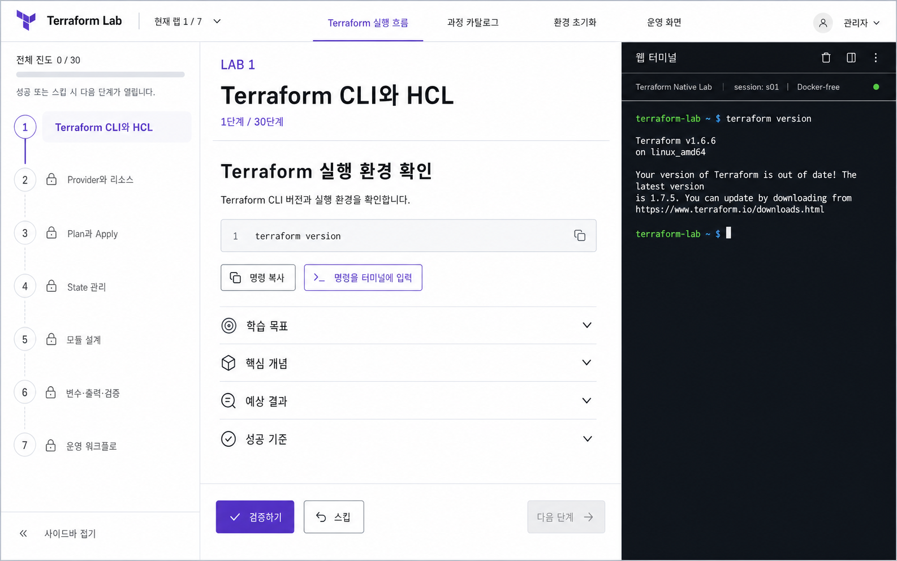

# Terraform Lab Desktop Design

[한국어](README.md) · [English](README.en.md)

## Purpose

Desktop UI guidance for arranging lesson content, navigation, and a terminal in one view.

## Benefits

- Reduce switching between instructions and commands while making progress visible.

## Features and structure

- Three-column layout with light navigation, lesson content, and a dark terminal
- Copy, send-to-terminal, validate, skip, and next-step actions
- Purple accents and consistent success, locked, and skipped states

## Getting started

## Scope and limitations

This is a concept image; its CLI version and step count are not the curriculum contract. Refer to runtime configuration and course documentation. A dedicated mobile layout is out of scope.
